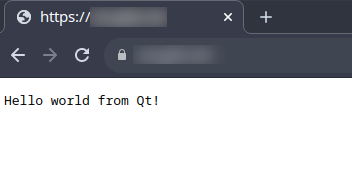

# HTTPS REST API
An example HTTPS REST API built with Qt framework, Caddy enterprise HTTPS server and Docker
containers - [see linked
article](https://medium.com/@petar.koretic/building-rest-apis-with-qt-docker-and-caddy-b669e36b96c5)

## Configuration

The solution is built with Docker compose so check `compose.yml`.
Exposed HTTPS port can be overriden with `HTTPS_PORT` enviroment variable.

## Build & Run

First build the docker image for HTTP REST API with QT.

`docker build -t qtdockercaddy .`

Then bring the whole stack up with Caddy HTTPS reverse proxy included.

> Make sure to create external volume for caddy if not existing:
`docker volume create caddy_data`

`docker compose up`

This will run the HTTPS REST API with self signed certificate at https://localhost:8181.

